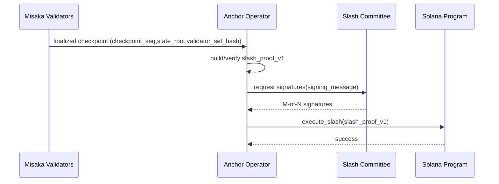
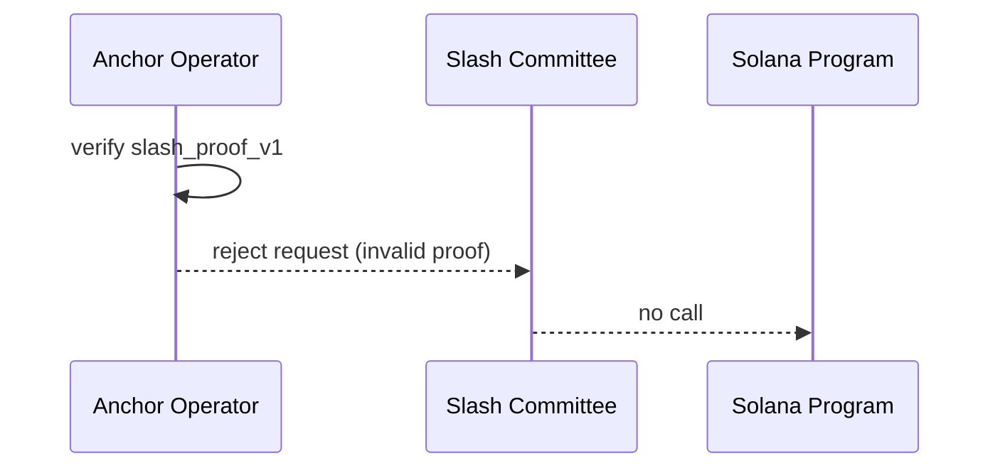
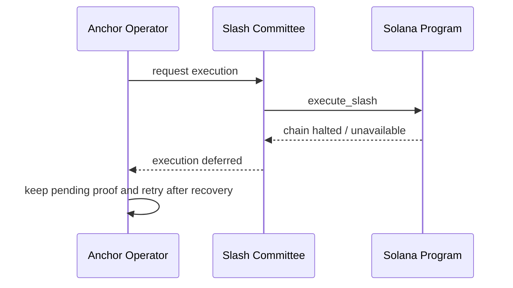

# 06 Anchor Collateral Phase 1 仕様

## 1. 目的と適用範囲
本仕様は Phase 1 における Anchor 連携を定義する。
Phase 1 の Anchor は **MUST** 以下に限定される。
- 担保ロック（lock）
- アンボンド開始/完了管理（unbond）
- 引き出し実行（withdraw）

Phase 1 では、完全 trustless なクロスチェーン slashing は提供しない。
slashing 実行は **MUST** Misaka finality と外部 Multisig（M-of-N）の二重条件で成立する。

## 2. 規範キーワード
- **MUST**: 準拠実装に必須
- **SHOULD**: 特段の理由がない限り必須
- **MAY**: 任意

## 3. 前提用語
- `checkpoint_seq`, `state_root`, `validator_set_hash`: `01-tx-object-checkpoint.md`
- finality: `02-consensus.md`
- `checkpoint_tx_digest_list`: `03-deterministic-execution.md`
- `MCS-1`: `01-tx-object-checkpoint.md`

## 4. 役割分担（信頼境界）
- **Misaka Validators**: 事象の finality（`checkpoint_seq`, `state_root`, `validator_set_hash`）を確定する主体。
- **Slash Committee（External Multisig）**: 外部チェーンで slash 実行可否を最終承認する主体。
- **Anchor Operator**: proof を検証し、committee 署名収集と実行依頼を行う主体。
- **Solana Program**: 受領 proof を on-chain 検証し、最終的な slash 実行可否を決定する主体。

役割規範:
- slash 事象の一次正当性（証跡整合）は **MUST** Misaka finality に依存する。
- 外部チェーン実行可否は **MUST** Slash Committee が判断する。
- Solana Program は **MUST NOT** committee 承認なしで slash を実行する。

## 5. Multisig パラメータ
- `committee_n`（総署名者数）
- `committee_m`（必要署名数）

規範:
- `committee_m` は **MUST** `ceil(2 * committee_n / 3)` 以上。
- `committee_n` と `committee_m` は **MUST** `sys/params/*` に保存し、ガバナンス経由でのみ変更可能。

## 6. Slash 成立条件（Phase 1 固定）
slash は以下を同時に満たす場合のみ **MUST** 成立する。
1. Misaka finality 証明が有効
2. `slash_proof_v1` が形式/署名検証に成功
3. committee 署名が `committee_m` 以上
4. proof 有効期限（`expiry_ms`）内

いずれか欠ける場合、slash は **MUST NOT** 実行される。

## 7. `slash_proof_v1` payload 形式

### 7.1 構造体（MCS-1 順序固定）
1. `proof_format_version: u16`（固定値 `1`）
2. `chain_id: u32`
3. `checkpoint_seq: u64`
4. `checkpoint_digest: bytes[32]`
5. `state_root: bytes[32]`
6. `validator_set_hash: bytes[32]`
7. `accused_validator_pubkey: bytes[32]`
8. `violation_type: u8`（`1=DOUBLE_SIGN`, `2=DOWNTIME`, `3=INVALID_PROPOSAL`）
9. `penalty_bps: u16`
10. `evidence_digest: bytes[32]`
11. `tx_digest_merkle_proof: list<bytes[32]>`
12. `nonce: u64`
13. `expiry_ms: u64`
14. `committee_id: bytes[32]`
15. `committee_signatures: list<bytes>`

### 7.2 署名対象メッセージ
`committee_signatures` の署名対象は **MUST** 以下とする。

`signing_message = SHA3-256("MISAKA_SLASH_V1" || MCS-1(fields 1..14))`

### 7.3 妥当性検証
`slash_proof_v1` は以下を **MUST** 満たす。
- `checkpoint_digest == SHA3-256(MCS-1(CheckpointHeader))`
- `state_root` が当該 `checkpoint_seq` の確定値と一致
- `validator_set_hash` が当該チェックポイントの確定値と一致
- `committee_signatures` が `committee_m` 以上で有効
- `expiry_ms >= now_ms`
- 同一 `(checkpoint_seq, accused_validator_pubkey, nonce)` の再利用は **MUST NOT** 許可

## 8. lock / unbond / withdraw 規則
### 8.1 lock
- lock は **MUST** `validator_pubkey` と担保量を紐付けて記録する。
- lock された担保は **MUST NOT** unbond 完了前に withdraw できない。

### 8.2 unbond
- unbond 開始は **MUST** checkpoint 境界で記録する。
- `UNBONDING_DELAY_CHECKPOINTS`（初期値 `14_400`）経過前の withdraw は **MUST NOT** 許可。

### 8.3 withdraw
- withdraw は **MUST** unbond 完了後のみ許可。
- slash 保留中の担保は **MUST NOT** withdraw できない。

## 9. 失敗時の扱い
- 不正 proof は **MUST** `ERR_INVALID_SLASH_PROOF` で拒否。
- committee 署名不足は **MUST** `ERR_INSUFFICIENT_COMMITTEE_SIGS`。
- 有効期限切れは **MUST** `ERR_SLASH_PROOF_EXPIRED`。

## 10. 検証シーケンス（必須3ケース）

### 10.1 正当 slash

### 10.2 不正 proof

### 10.3 Solana 停止

## 11. フェーズ移行条件
- 本仕様は **MUST** Phase 1 専用とする。
- `07-crosschain-trust-model.md` で定義する Phase 3 trustless 条件が有効化された場合、本仕様の committee 依存フローは **MUST NOT** 新規適用される。

## 12. 他仕様参照
- `01-tx-object-checkpoint.md`
- `02-consensus.md`
- `03-deterministic-execution.md`
- `05-storage-layout.md`
- `07-crosschain-trust-model.md`
